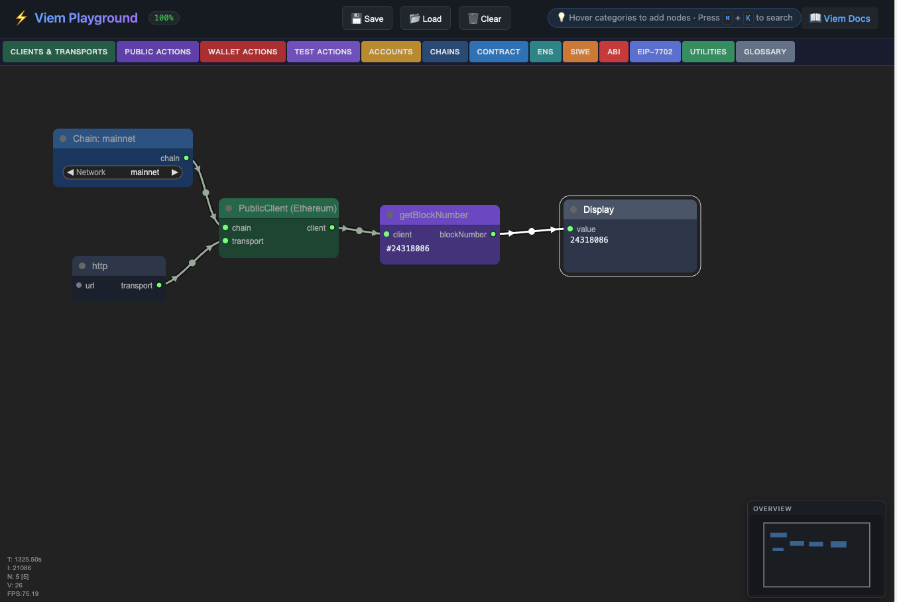

# Viem Playground ⚡

A visual node-based Web3 API builder and debugging tool. Inspired by [eth.build](https://github.com/austintgriffith/eth.build) and powered by [Viem](https://viem.sh/).

[English](./README.md) | [简体中文](./README_ZH.md)



## 🌟 Features

- **Visual Programming**: Build complex blockchain logic using an intuitive node-link interface.
- **Comprehensive Viem Support**:
  - **Clients**: Public, Wallet, and Test Clients.
  - **Actions**: Get balance, send transactions, watch blocks, read/write contracts, and more.
  - **Accounts**: Support for Private Key, Mnemonic, and JSON-RPC accounts.
  - **Ens/Siwe/Abi**: Built-in nodes for ENS resolution, SIWE signing, and ABI encoding/decoding.
- **High Efficiency**:
  - **Quick Search**: Press `⌘ + K` (or `Ctrl + K`) to instantly find and add any node.
  - **Auto-Pairing**: Double-click input/output slots to automatically suggest and connect matching nodes.
  - **Minimap**: High-level overview in the bottom right for quick navigation in large workspaces.
- **Project Management**: Save designs locally to browser storage, or export/import as JSON files.

## 🛠️ Technology Stack

- **Framework**: [React 19](https://reactjs.org/)
- **Build Tool**: [Vite](https://vitejs.dev/)
- **Web3 Library**: [Viem](https://viem.sh/)
- **Graphics Engine**: [LiteGraph.js](https://github.com/jagenjo/litegraph.ts)
- **State Management**: [Zustand](https://github.com/pmndrs/zustand)
- **Styling**: Vanilla CSS

## 🚀 Quick Start

### Install Dependencies

`pnpm` is recommended:

```bash
pnpm install
```

### Start Development Server

```bash
pnpm dev
```

Open `http://localhost:5173` in your browser.

## 📖 Usage Guide

1. **Add Nodes**:
   - Hover over the top category menu to pick a node.
   - Or use `⌘ + K` for a global command palette.
2. **Connect Nodes**:
   - Drag from an output slot to an input slot.
   - **Tip**: Double-click an empty slot to auto-create and connect a relevant node.
3. **Save & Load**:
   - Click `Save` in the top right to download your design as a JSON file.
   - Click `Load` to upload a JSON file and restore your workspace.

## 🧪 Testing

- [Testing Strategy](./TESTING.md)
- [测试方案 (中文)](./TESTING_ZH.md)

## 🚧 Roadmap / TODO

- [ ] Dynamically generate nodes based on configuration.

## 📄 License

MIT
